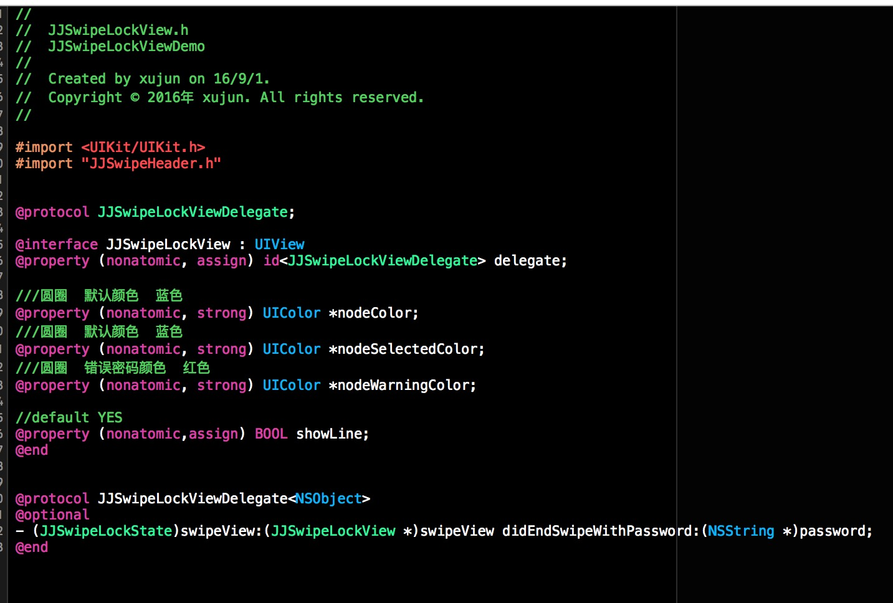
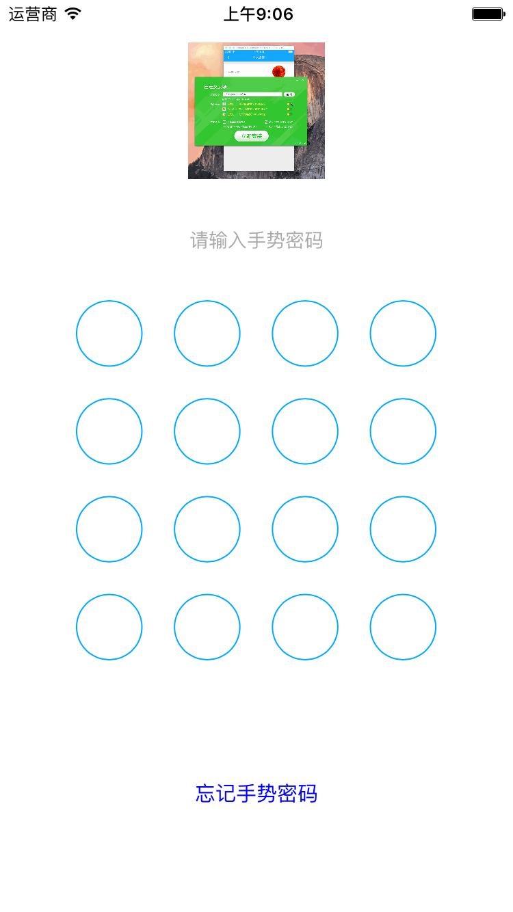
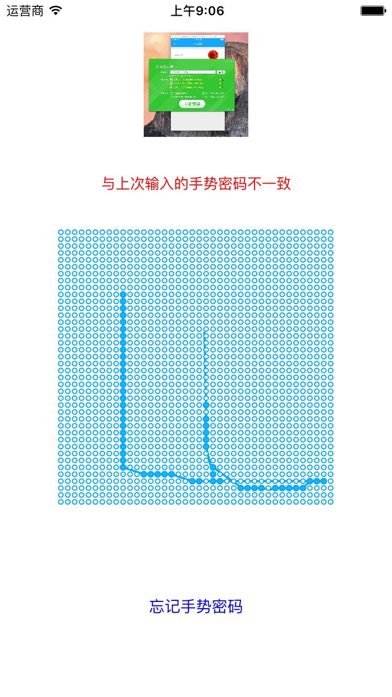
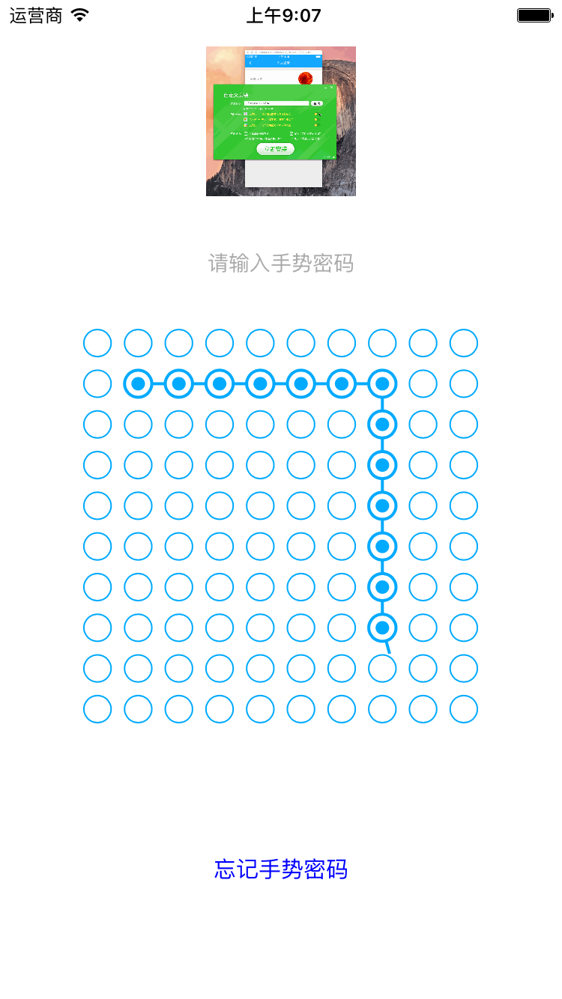

# JJSwipeLockView
a swipe password view to unlock an application written in objective-c








## Requirements

JJSwipeLockView works on iOS 6.0 and later version and is compatible with ARC projects. It depends on the following Apple frameworks, which should already be included with most Xcode templates:

* Foundation.framework
* UIKit.framework
* CoreGraphics.framework
* QuartzCore.framework

## Usage

 1. Copy the JJSwipeLockView folder to your project.
 2. Add JJSwipeMainView as a subview wherever you want and set a delegate to this JJSwipeLockView.

```objective-c

//JJSwipePasswordViewController

JJSwipePasswordViewController *vc = [JJSwipePasswordViewController defaultViewControllerWithStyle:JJSwipePasswordStyleCreate];
[self presentViewController:vc animated:YES completion:nil];
		
    
- (JJSwipeLockState)swipeView:(JJSwipeMainView *)swipeView didEndSwipeWithPassword:(NSString *)password
{
    //do something
}

```
## License

This code is distributed under the terms and conditions of the [MIT license](LICENSE).
# JJGestureUnlockPassword
